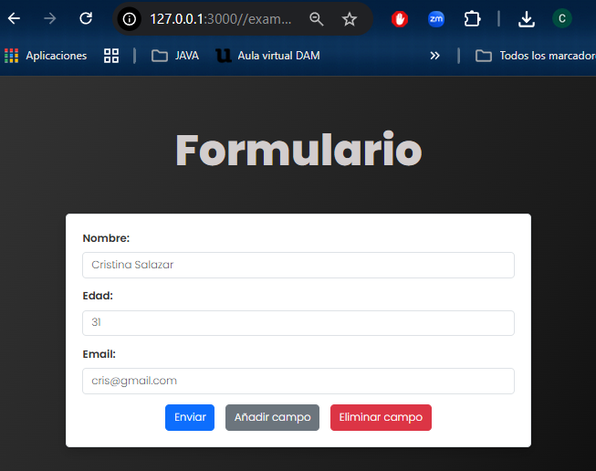

# 🌐 Formulario Dinámico con Manipulación del DOM

Este repositorio contiene la solución a la prueba práctica de la asignatura de Desarrollo de Interfaces, enfocada en la creación de una página web con un formulario interactivo y dinámico.

## Descripción de la Actividad

El objetivo principal de esta actividad fue diseñar e implementar una interfaz de formulario dinámica, asegurando la usabilidad, la validación de datos y la adaptabilidad del diseño.

### Funcionalidades Clave:

* [cite_start]**Formulario Base:** Captura datos de usuario esenciales (nombre, edad, correo electrónico)[cite: 14].
* [cite_start]**Campos Dinámicos:** Implementación de un botón para **añadir** nuevos campos personalizados (ej. "Afición", "Red social favorita") y otro botón para **eliminar** el último campo añadido[cite: 15, 16, 23].
* [cite_start]**Validaciones:** Uso de validaciones HTML5 (como `required`) para campos obligatorios (nombre y correo electrónico)[cite: 17, 24].
* [cite_start]**Diseño Responsive:** Aplicación de estilos CSS para una buena presentación y adaptación a pantallas pequeñas (móviles) usando `media queries`[cite: 18, 25].
* [cite_start]**Reutilización:** Implementación de al menos un componente reutilizable (por ejemplo, un cuadro de diálogo o un modal)[cite: 19, 26].
* [cite_start]**Manipulación del DOM:** Uso de JavaScript para incorporar y eliminar elementos del formulario de manera eficiente[cite: 11, 23].

## Captura de Pantalla del Formulario

Aquí se muestra la interfaz del formulario dinámico:

## Tecnologías Utilizadas

* [cite_start]**HTML5:** Estructura básica del formulario y uso de atributos de validación nativos (`required`, `pattern`)[cite: 9, 24].
* [cite_start]**CSS3:** Estilizado, maquetación y diseño *responsive*[cite: 18, 25].
* [cite_start]**JavaScript:** Manejo dinámico del DOM para añadir/eliminar campos, implementar la interactividad y los cuadros de diálogo[cite: 11, 23].
* **Visual Studio Code:** Entorno de desarrollo utilizado.
